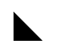

## 操作CSS

### CSS类

`Element`对象的`classList`属性可以用来方便地对HTML的`class`属性添加或删除。

假设文档包含`hidden`类：

```js
document.querySelector("#tooltip").classList.remove("hidden");

document.querySelector("#tooltip").classList.add("hidden");
```

### 行内样式

DOM在所有`Element`上都定义了`style`属性，该`style`属性是`CSSStyleDeclaration`对象，是对HTML里作为`style`属性值的CSS样式文本解析后得到的一个表示。

```js
function displayAt(tooltip, x, y){
    tooltip.style.display = "block";
    tooltip.style.position = "absolute";
    tooltip.style.left = `${x}px`;
    tooltip.style.right = `${y}px`;
}
```

CSS属性名里的连字符在对应的`CSSStyleDeclaration`属性名里会被剔除，并将连字符后的字母转为大写，即如CSS的`font-family`在JS中转为`fontFamily`。

CSS中：

```css
display: block;
font-family: sans-serif;
background-color: #ffffff;
```

JS中，假设操作元素`e`：

```js
e.style.display = "block";
e.style.fontFamily = "sans-serif";
e.style.backgroundColor = "#ffffff";
```

将某个CSS属性设置为计算值，也要确保在计算表达式末尾加上单位：

```js
e.style.left = `${x0 + left_border + left_border}px`;
```

`style`属性只表示元素的行内样式。大多元素的多样式都是在样式表中指定。

### 计算样式

元素的计算样式(computed style)：浏览器根据一个元素的行内样式和所有样式表中适用的样式规则导出的一组属性值。

计算样式也用`CSSStyleDeclaration`表示，但计算样式只读。

`window.getComputedStyle(查询元素, CSS伪元素)`：获取一个元素的计算样式，返回值是`CSSStyleDeclaration`对象，该对象包含应用给指定元素(或伪元素)的所有样式。

```js
let title = document.querySelector("#section1title");
let styles = window.getComputedStyle(title);
let beforeStyles = window.getComputedStyle(title, "::before");
```

- 计算样式的属性只读
- 计算样式的属性是绝对值，百分比和点等相对单位都被转为绝对值。任何指定大小的属性都将以像素度量。值为颜色的属性将以`"rgb()"`格式返回。
- 简写属性不会被计算，只有它们代表的基础属性会被计算。如不能查`margin`属性，而要查`marginLeft`、`marginTop`等。
- 计算样式的`cssText`属性是`undefined`。

### 操作样式表

样式表通过`<style>`或`<link rel="stylesheet">`与HTML关联的。可以给它们指定`id`属性，然后用`querySelector()`找到他们。

`<style>`和`<link>`对应的`Element`对象都有`disabled`属性，可以用它禁用整个样式表。

```js
// 该函数实现 light 和 dark 主题切换
function toggleTheme() {
    let lightTheme = document.querySelector("#light-theme");
    let darkTheme = document.querySelector("#dark-theme");
    if (darkTheme.disabled) {		// 当前是浅色主题 切换到深色主题
        lightTheme.disabled = true;
        darkTheme.disabled = false;
    } else {
        lightTheme.disabled = false;
        darkTheme.disabled = true;
    }
}
```

插入新样式表：

```js
function setTheme(name) {
    let link = document.createElement("link");
    link.id = "theme";
    link.rel = "stylesheet";
    link.href = `themes/${name}.css`;
    
    // 通过id="theme"查找当前的<link>元素
    let currentTheme = document.querySelector("#theme");
    if(currentTheme){
        currentTheme.replaceWith(link);
    } else {
        document.head.append(link);
    }
}
```

### CSS动画与事件

```css
.transparent { opacity: 0; }					/* 完全透明 */
.fadeable { transition: opacity .5s ease-in } 	/* 不透明度变化 0.5秒 */
```

HTML：

```html
<div id="subscribe" class="fadeable notification">
    ...
</div>
```

JS：

```js
document.querySelector("#subscribe").classList.add("transparent");
```

该元素为不透明度动画配置。给其添加`"transparent"`类，会触发动画：浏览器半秒内让元素'"淡出"为完全透明。

相反如果移除该类，则元素淡入。

首次触发过渡时，浏览器派发`"transitionrun"`事件。当视觉上发生变化时，派发`"transitionstart"`事件，动画完成时，派发`"transitionend"`事件。这些事件的目标都是发生动画的元素。这些事件传给处理程序的事件对象是个`"Transitionend"`。该对象的`propertyName`属性是发生动画的CSS属性，`"transitionend"`事件对应的事件对象的`elapsedTime`属性是从`"transitionstart"`事件开始经过的秒数。

CSS动画也触发事件，可以供JS代码监听：

- 动画开始时触发`"animationstart"`事件
- 动画完成时触发`"animationend"`事件
- 动画每次重复(不包括最后一次)都会触发`"animationiteration"`事件

事件目标是发生动画的元素，传给处理程序的事件对象是`AnimationEvent`对象。该对象的`animationName`属性是定义动画的`animation-name`属性，`elapsedTime`属性反映了自动画开始以后经过了多少秒。

## 文档几何与滚动

有时候必须要知道某个元素精确的几何位置。

### 文档坐标与视口坐标

文档元素的位置以CSS像素度量：元素的x和y坐标可以相对于文档的左上角，也可以相对于显示文档的视口(viewport)的左上角。

### 查询元素的几何大小

`getBoundingClientRect()`：确定元素大小和位置。返回一个对象，对象属性`left`和`top`是元素左上角的x和y坐标，`right`和`bottom`是右下角的坐标。这两对属性值的差就是`width`和`height`。

块级元素在浏览器的布局始终是矩形。

行内元素可能跨行，因而包含多个矩形。如`<em>`和`</em>`标签间的文本显示在两行上，则它的矩形会包含第一行末尾和第二行开头。若在该元素上调用`getBoundingClientRect()`，则边界矩形将包含两行的整个宽度。如果想查询行内元素中的个别矩形，可以调用`getClientRects()`，得到一个只读的类数组对象，元素类似`getBoundingClientRect()`返回的举行对象。

### 确定位于某一点的元素

`Document`对象的`elementFromPoint()`：确定在视口中某个给定位置上的是哪个元素。需要传入x和y的视口坐标。返回位于指定位置的`Element`对象。返回相应位置上最内部(嵌套最深)、最外层(最大的CSS`z-index`属性)的元素。

### 滚动

`Window`的`scrollTo()`接受x和y坐标(文档坐标)。滚动窗口，让指定的点位于视口的左上角。

```js
// 滚动浏览器让文档最底部的页面显示出来

// 取得文档和视口的高度
let documentHeight = document.documentElement.offsetHeight;
let viewportHeight = window.innerHeight;

// 滚动到最后一"页"在视口中可见
window.scrollTo(0, documentHeight - viewportHeight);
```

还有个`scrollBy()`方法与`scrollTo()`类似，但其参数是个相对值，会加在当前滚动位置上：

```js
// 每500毫秒向下滚动50像素 无法停止
setInterval(() => { scrollBy(0, 50)}, 500 );
```

想让`scrollTo()`和`scrollBy()`平滑滚动，需要传入一个对象：

```js
window.scrollTo({
    left: 0,
    top: documentHeight - viewportHeight,
    behavior: "smooth"
});
```

HTML元素上调用`scrollIntoView()`：滚动到某个元素的视口中可见。

- 默认情况下，滚动后的结果会尽量让元素的上边对齐或接近视口上沿。
- 若给该方法传入唯一的参数`false`，则滚动后的结果会尽量让元素的底边对齐视口下沿。
- 传入对象，设置：
  - `behavior: "smooth"`：实现平滑滚动
  - `block`属性：指定元素在垂直方向上如何定位
  - `inline`属性：指定元素在水平方向上如何定位
  - 这两个属性的有效值均包括`start`、`end`、`nearest`、`center`

### 视口大小、内容大小和滚动位置

浏览器窗口的视口大小获得：`window.innerWidth`和`window.innerHeight`

文档的整体大小与`<html>`元素相同：`document.documentElement`。

获得文档宽度和高度：`document.documentElement`的`getBoundingClientRect()`方法，也可以用`document.documentElement`的`offsetWidth`和`offsetHeight`。

文档在视口中的滚动位移可以通过`window.scrollX`和`window.scrollY`获得。这两个属性都是只读，所以不能设置它们的值来滚动文档。

滚动文档应该用`window.scrollTo()`。

每个`Element`对象都定义了下列三组属性：

1. `offset`：只读
   - `offsetWidth`和`offsetHeight`：它们在屏幕上的CSS像素大小。包含元素边框和内边距，但不含外边距。
   - `offsetleft`和`offsetTop`：元素的`x`和`y`坐标。对很多元素来说，这是文档坐标。但对定位元素的后代或一些如表格单元来说，是相对于祖先元素而非文档的坐标。
   - `offsetParent`：保存前述坐标值相对于哪个元素。
2. `cliend`：只读
   - `cliendWidth`和`cliendHeight`：类似`offset`对应的，但不含元素边框，只包含内容区及内边距。
   - `cliendLeft`和`cliendTop`：元素内边距外沿到边框外沿的水平和垂直距离。
3. `scroll`
   1. `scrollWidth`和`scrollHeight`：元素内容区大小加上元素内边距再加溢出内容的大小。内容没溢出时与`client`对应的相等。
   2. `scrollLeft`和`scrollTop`：元素内容在元素视口中的滚动位移。可写属性。

## Web组件

### 使用Web组件

Web组件在JS中定义，要在HTML中使用Web组件，需要包含定义该组件的JS文件。

```html
<script type="module" src="components/search-box.js"></script>
```

Web组件要定义自己的HTML标签名，标签名必须包含一个连字符。使用Web组件，像如下使用在HTML文件中使用标签即可：

```html
<serach-box placeholder="Search..."></serach-box>
```

Web组件不能使用自关闭标签定义，如不能`<search-box />`

Web组件可以有子组件。有的Web组件可选地接收有标识地子组件，这些子组件会出现在命名的"插槽"(slot)中。

```html
<search-box>		</search-box>
```

插槽名`left`和`right`由该Web组件定义。

当在Web组件还没定义就遇到其标签时，浏览器会向DOM树添加一个通用的`HTMLElement`，即便它们不知道要对它做什么。之后，当自定义元素有定义之后，该通用元素会被"升级"，从而具备预期地外观和行为。

如果Web组件包含子元素，那么在组件有定义前它们可能会被不适当地显示出来。可以使用下面的CSS将Web组件隐藏到它们有定义为止：

```css
/*
 * 让<search-box>组件在定义前不可见
 * 同时尝试复现其最终布局和大小 以便近旁内容在它有定义时不会移动
 */
search-box:not(:defined) {
    opacity: 0;
    display: inline-block;
    width: 300px;
    height: 50px;
}
```

Web组件实现通常会为它们支持的每个HTML属性都定义一个JS属性。

使用的Web组建的文档应该指出可以在JS中使用什么属性和方法。

DOM API将文档组织成一个Node对象树，其中Node可以是`Document`、`Element`、`Text`或`Comment`节点。但这些节点类型不能用于表示一个文档片段，或者一组没有父节点的同辈节点。

`DocumentFragment`：一种`Node`类型，可以临时充当一组同辈节点的父节点，方便将这些同辈节点作为一个单元使用。

- 创建：`document.createDocumentFragment()`
- 添加内容：`append()`
- 与`Element`的区别：没有父节点。
- 向文档插入`DocumentFragment`节点时，`DocumentFragment`本身不会被插入，实际上插入的是它的子节点。

### HTML模板

HTML的`<template>`标签及其子元素永远不会被浏览器渲染，只能在使用JS的网页中使用。通过它可以对页面中经常使用的组件进行优化。

JS里该标签对应的是`HTMLTemplateElement`对象。该对象有个`content`属性，属性值包含`<template>`所有子节点的`DocumentFragment`。克隆`DocumentFragment`再将克隆的副本插入文档中需要的地方。该片段自身不会被插入，只有其子节点会。

假设文档中有个`<table>`和`<template id="row">`标签，后者作为模板定义了表格中行的结构，可以如下使用模板：

```js
let tableBody = document.querySelector("tbody");
let template = document.querySelector("#row");
let clone = document.template.content.cloneNode(true);		// 深度克隆

// 先用DOM把内容插入克隆的<td>元素
// 然后将克隆且已初始化的表格行插入表格体
tableBody.append(clone);
```

### 自定义元素

可以将一个HTML标签与一个JS类关联起来，之后文档中出现的这个标签就会在DOM树里转为相应类的实例。

创建自定义元素需要用`customElements.define()`方法：

1. 参数一：Web组件的标签名(标签名必须包含一个连字符)
2. 参数二：`HTMLElement`的子类

文档中具有该标签名的任何元素都会被"升级"为该类的一个新实例。若浏览器将来再解析HTML，都会自动为遇到的标签创建一个该类的实例。

传给`customElements.define()`的类应该扩展`HTMLElement`，但不要是更具体的类型。

当自定义元素被插入文档时，会调用`connectedCallback()`方法。很多自定义元素通过该方法执行初始化。

`disconnectedCallback()`会在自定义元素从文档中被移除时调用。

若自定义元素类定义了静态的`observedAttributes`属性，这个属性的值是个存有属性名的数组，然后如果这些属性名有一个在这个自定义元素的实例上被设置或者修改，那么浏览器就会调用`attributeChangedCallback(属性名, 旧值, 新值)`方法。

创建自定义元素示例：

```js
customElements.define("inline-circle", class InlineCircle extends HTMLElement {
    // 浏览器会在一个<inline-circle>元素被插入文档时调用这个方法
    connectedCallback() {
        this.style.display = "inline-block";
        this.style.borderRadius = "50%";
        this.style.border = "solid black 1px";
        this.style.transform = "translate(10%)";
        // 如果没有定义大小 则给予当前字体大小设置一个默认大小
        if (!this.style.width) {
            this.style.width = "0.8em";
            this.style.height = "0.8em";
        }
    }
    
    // 这个静态的observedAttributes用于指定我们想在哪些属性变化时收到通知
    static get observedAttributes() { return ["diameter", "color"]; }
    
    // 该回调会在上面列出的属性变化时被调用
    attributeChangedCallback(name, oldValue, newValue) {
        switch(name) {
            case "diameter":
                // 如果diameter属性改变 更新大小
                this.style.width = newValue;
                this.style.height = newValue;
                break;
            case "color":
                this.style.backgroundColor = newValue;
                break;
        }
    }
    
    // 定义和元素的标签属性对应的JS属性
    // 此处获取和设置方法只是获取和设置底层属性
    // 如果设置了JS的属性 那么修改底层的属性会触发调用attributeChangedCallback() 进而更新元素的样式
    get diameter() { return this.getAttribute("diameter"); }
    set diameter(diameter) { this.setAttribute("diameter", diameter); }
    get color() { return this.getAttribute("color"); }
    set color(color) { this.setAttribute("color", color); }
})
```

### 影子DOM

**影子DOM**(shadow DOM)。影子：作为影子根节点后代的元素"藏在影子里"。该子树不属于常规DOM树，不会出现在它们宿主元素的`children`数组里，且对`querySelector()`等常规DOM遍历方法也不可见。

可以把一个"**影子根节点**"(shadow root)附加给一个自定义元素。这里的自定义元素称为"**影子宿主**"(shadow host)。影子宿主元素与所有HTML元素一致，随时可以作为包含后代元素和文本节点的正常DOM树的根。

影子宿主的常规、普通DOM子树有时又称"阳光DOM"(light DOM)。

#### 影子DOM封装

影子根节点的后代对常规DOM树而言是隐藏且独立的，几乎就像是它们是在一个独立的文档中一样。

1. 在创建影子根节点并将其附加于影子宿主时，可以指定其模式：
   - 开放(open)：影子宿主会有个`shadowRoot`属性，JS可以通过该属性访问影子根节点的元素
   - 关闭(closed)：影子根节点被完全封闭，不可访问
2. 在影子根节点下定义的样式对该子树是私有的，永远不会影响外部的阳光DOM元素。影子DOM的元素会从阳光DOM继承字体大小和背景颜色等，影子DOM的样式可以选择阳光DOM中定义的CSS变量。
3. 影子DOM中发生的某些事件(如"load")会被封闭在影子DOM里。另一些事件，像`focus`、`mouse`和键盘事件向上冒泡、穿透影子DOM。一个发源于影子DOM内的事件跨过了边界开始向阳光DOM传播时，其`target`属性会变成影子宿主元素，就像事件直接起源于该元素一样。

#### 影子DOM插槽和阳光DOM子元素

作为影子宿主的HTML元素有两个后代子树：

1. `children[]`数组，宿主元素常规阳光DOM后代
2. 影子根节点及其后代

它们的工作原理：

- 影子根节点的后代始终显示在影子宿主内
- `<slot>`元素：
  - 若这些后代有个`<slot>`元素，则宿主元素的常规阳光DOM子元素会像它们本来就是该`<slot>`的子元素一样显示，替代该插槽中的任何影子DOM元素。
  - 如果影子DOM不包含`<slot>`，那么宿主的阳光DOM内容永远不会显示。
  - 如果影子DOM有个`<slot>`，但影子宿主没有DOM子元素，那么该插槽的影子DOM内容作为默认内容显示。
- 阳光DOM内容显示在影子DOM插槽里时，称那些元素"已分配"(distributed)：那些元素实际上未变成影子DOM一部分。使用`querySelector()`还是可以找到它们，仍作为宿主元素的子元素或后代出现在阳光DOM里。
- 如果影子DOM定义了多个`<slot>`，且通过`name`属性为他们命名，那么影子宿主的阳光DOM后代可以通过`slot="slotname"`属性指定自己想出现在哪个插槽里。

#### 影子DOM API

将一个阳光DOM元素转为影子宿主，只要调用其`attachShadow()`方法，传入`{mode: "open"}`这个唯一参数即可。该方法返回一个影子根节点对象，同时也将该对象设为该数组的`shadowRoot`属性值。

Web组件如果想知道影子ODM(`slot`)中的阳光DOM内容什么时候变化，可以直接在该`<slot>`元素上注册一个`"slotchanged"`事件。

## 可伸缩矢量图形

SVG是种图片格式。

### 在HTML中使用SVG

可以用``标签显示也可以直接在HTML嵌入SVG。

### 编程操作SVG

直接在HTML文件中嵌入SVG的一个原因，就是这样可以使用DOM API操作SVG图片。

假设想使用SVG在网页中显示一个图标，可以把SVG嵌入一个`<template>`标签中，然后在需要向UI中插入图标副本时克隆该模板的内容。

### 通过JavaScript创建SVG图片

使用`createElmentsNS()`可以创建SVG元素，该函数第一个参数是XML命名空间文字串。

对SVG而言，命名空间是文字串`"http://www.w3.org/2000/svg"`。

创建SVG饼图示例：

```js
/**
 * Create an <svg> element and draw a pie chart into it.
 *
 * This function expects an object argument with the following properties:
 *
 *   width, height: the size of the SVG graphic, in pixels
 *   cx, cy, r: the center and radius of the pie
 *   lx, ly: the upper-left corner of the chart legend
 *   data: an object whose property names are data labels and whose
 *         property values are the values associated with each label
 *
 * The function returns an <svg> element. The caller must insert it into
 * the document in order to make it visible.
 */
function pieChart(options) {
    let {width, height, cx, cy, r, lx, ly, data} = options;

    // This is the XML namespace for svg elements
    let svg = "http://www.w3.org/2000/svg";

    // Create the <svg> element, and specify pixel size and user coordinates
    let chart = document.createElementNS(svg, "svg");
    chart.setAttribute("width", width);
    chart.setAttribute("height", height);
    chart.setAttribute("viewBox", `0 0 ${width} ${height}`);

    // Define the text styles we'll use for the chart. If we leave these
    // values unset here, they can be set with CSS instead.
    chart.setAttribute("font-family", "sans-serif");
    chart.setAttribute("font-size", "18");

    // Get labels and values as arrays and add up the values so we know how
    // big the pie is.
    let labels = Object.keys(data);
    let values = Object.values(data);
    let total = values.reduce((x,y) => x+y);

    // Figure out the angles for all the slices. Slice i starts at angles[i]
    // and ends at angles[i+1]. The angles are measured in radians.
    let angles = [0];
    values.forEach((x, i) => angles.push(angles[i] + x/total * 2 * Math.PI));

    // Now loop through the slices of the pie
    values.forEach((value, i) => {
        // Compute the two points where our slice intersects the circle
        // These formulas are chosen so that an angle of 0 is at 12 o'clock
        // and positive angles increase clockwise.
        let x1 = cx + r * Math.sin(angles[i]);
        let y1 = cy - r * Math.cos(angles[i]);
        let x2 = cx + r * Math.sin(angles[i+1]);
        let y2 = cy - r * Math.cos(angles[i+1]);

        // This is a flag for angles larger than a half circle
        // It is required by the SVG arc drawing component
        let big = (angles[i+1] - angles[i] > Math.PI) ? 1 : 0;

        // This string describes how to draw a slice of the pie chart:
        let path = `M${cx},${cy}` +     // Move to circle center.
            `L${x1},${y1}` +            // Draw line to (x1,y1).
            `A${r},${r} 0 ${big} 1` +   // Draw an arc of radius r...
            `${x2},${y2}` +             // ...ending at to (x2,y2).
            "Z";                        // Close path back to (cx,cy).

        // Compute the CSS color for this slice. This formula works for only
        // about 15 colors. So don't include more than 15 slices in a chart.
        let color = `hsl(${(i*40)%360},${90-3*i}%,${50+2*i}%)`;

        // We describe a slice with a <path> element. Note createElementNS().
        let slice = document.createElementNS(svg, "path");

        // Now set attributes on the <path> element
        slice.setAttribute("d", path);           // Set the path for this slice
        slice.setAttribute("fill", color);       // Set slice color
        slice.setAttribute("stroke", "black");   // Outline slice in black
        slice.setAttribute("stroke-width", "1"); // 1 CSS pixel thick
        chart.append(slice);                     // Add slice to chart

        // Now draw a little matching square for the key
        let icon = document.createElementNS(svg, "rect");
        icon.setAttribute("x", lx);              // Position the square
        icon.setAttribute("y", ly + 30*i);
        icon.setAttribute("width", 20);          // Size the square
        icon.setAttribute("height", 20);
        icon.setAttribute("fill", color);        // Same fill color as slice
        icon.setAttribute("stroke", "black");    // Same outline, too.
        icon.setAttribute("stroke-width", "1");
        chart.append(icon);                      // Add to the chart

        // And add a label to the right of the rectangle
        let label = document.createElementNS(svg, "text");
        label.setAttribute("x", lx + 30);        // Position the text
        label.setAttribute("y", ly + 30*i + 16);
        label.append(`${labels[i]} ${value}`);   // Add text to label
        chart.append(label);                     // Add label to the chart
    });

    return chart;
}
```

用于显示每个户型的元素是`<path>`。该SVG元素可以描述由任意直线和曲线组成的形状。对形状的描述通过`<path>`元素的`d`属性来指定。这个属性的值使用字母编码和数值的简略语法，指定了坐标、角度和其他值。

使用示例：

```js
document.querySelector("#chart").append(pieChart({
    width: 640, height: 400,		// 饼图的整体大小
    cx: 200, cy: 200, r: 180,		// 饼图的中心和半径
    lx: 400, ly: 10,				// 图例的位置
    data: {							// 要呈现的数据
        "JavaScript": 71.5,
        "Java": 45.4,
        "Bash/Shell": 40.4,
        "Python": 37.9,
        "C#": 35.3,
        "PHP": 31.4,
        "C++": 24.6,
        "C": 22.1,
        "TypeScript": 18.3,
        "Ruby": 10.3,
        "Swift": 8.3,
        "Objective-C": 7.3,
        "Go": 7.2,
    }
}));
```

## <canvas>图形

在HTML中，`<canvas>`元素本身并不可见，只是创建了一个绘图表面并向客户端JavaScript暴露了强大的绘图API。

`<canvas>`API与SVG的主要区别：使用画布(canvas)绘图要调用方法。

在调用`getContext()`时传入`"webgl"`也可以获取一个3D图形上下文，并使用WEBGL API来绘制3D图形。开发者通过它可以访问GPU、写自定义的着色器，以及执行其他强大的图形操作。

调用`getContext()`时传入`"2d"`可以得到一个`CanvasRenderingContext2D`对象，使用它能够在画布上绘制二维图形。

下面几节会演示2D Canvas API的方法和属性，其中多数示例中的代码都操作变量`c`：

```js
let canvas = document.querySelector("#my_canvas_id");
let c = canvas.getContext('2d');
```

### 路径与多边形

```js
c.beginPath();				// 开始一个新路径
c.moveTo(100, 100);			// 开始一个子路径 起点为(100, 100)
c.lineTo(200, 200);			// 将子路径100, 100连接到200, 200
c.lineTo(100, 200);			// 再将200, 200连接到100, 200

c.fill();				// 填充已连接区域
c.stroke();				// 描画已绘制的两条边
```



`fill()`方法在填充开放路径时，就像有条直线连接了子路径的终点与起点一样。这也是为什么以上代码填充的是三角形区域，而描画的只有三角形的两条边。

`closePath()`可以把子路径的终点连接到起点，也就是闭合。也可以`lineTo(100, 100)`，但这样的结果是三条共享起点和终点的线段，路径没有真正闭合。

`stroke()`和`fill()`需要注意的地方：

1. 作用于当前路径的所有子路径。
2. 会修改当前路径。在操作完一条路径后，如果想开始新的路径，应该用`beginPath()`。如果没有调用，那只会在已有路径上做操作。

当两个独立的子路径构成的图形重叠在一起时，画布使用"非零环绕规则"(nonzero winding rule)测试确定哪个区域在内部、哪个区域在外部。

例如一个按顺时针方向绘制的图形和按逆时针方向绘制的图形重叠时，那么`fill()`只会填充顺时针方向的部分。

### 画布大小与坐标

`<canvas>`可以通过`width`和`height`属性指定大小。

JavaScript中可以通过画布对象的`width`和`height`属性指定画布大小。

要修改画布大小会完全重置画布。

HTML里指定`<canvas>`的`width`和`height`属性会确定画布的实际像素数。每个像素的内存里会分配4个字节，如果`width`和`height`都是`100`，则画布在内存中用`40 000`个字节来表示`10 000`个像素。

HTML的宽高属性也指定了画布在屏幕上(以CSS像素)显示的默认大小。若`window.devicePixelRatio`是`2`，则`100×100`CSS像素实际上对应`40 000`个硬件像素。

即画布内容绘制到屏幕上时，内存中的`10 000`个像素需要放到成屏幕上的`40 000`个物理像素，也就是看到的图片会模糊。

所以为了优化图片质量，不要在HTML使用`width`和`height`设置画布的屏幕大小。要用CSS的属性`width`和`height`来设置画布在屏幕上的预期大小。然后在通过JS开始绘制前，再将画布对象的`width`和`height`属性设为CSS像素数乘以`window.devicePixelRatio`。仍以前面`100 × 100`CSS像素大小的画布为例，这样会导致画布显示为`100 × 100`CSS像素，但内存中分配`200 × 200`像素。

### 图形属性

#### 线条样式

`lineWidth`属性：指定绘制的线条宽度，默认为`1`。

```js
c.lineWidth = 5;
```

对于封闭路径：

- 只想外侧有线条：将路径线条画出，再用不透明的颜色填充，以此盖住路径内侧的部分线条。
- 只想内侧有线条：先调用`save()`和`clip()`方法，再调用`stroke()`和`restore()`。

`lineCap`：默认是平头(butt)

`lineJoin`：默认斜接(miter)

如果某个相交角斜接后长度超过线宽一半乘以`miterLimit`属性，则该相交角将改为斜切(bevel)而非斜接(miter)相交。

`miterLimit`默认值为`10`。

`strple()`方法既可以画虚线、点线，也可以画实线。而画布的图形状态中也有一组数字可以用作"虚线模式"，即通过数字描述画多少像素、忽略多少像素。

虚线模式通过`setLineDash()`和`getLineDash()`方法设置和获取。

指定虚线模式示例：

```js
c.setLineDash([18, 3, 3, 3]);		// 18px虚线、3px空格、3px点、3px空格
```

`lineDashOffset`属性指定虚线模式从哪开始绘制，默认是`0`。上面设置的虚线模式再绘制到封闭路径时会以`18`像素的虚线开始。当若将`lineDashOffset`设为`21`，则该路径将以点开始，后跟空格和虚线。

#### 颜色、模式与渐变

`fillStyle`和`strokeStyle`可以指定：

- 实色或半透明色：设为有效的CSS颜色字符串。
- 渐变色填充或描绘：`fillStyle`或`strokeStyle`设为`CanvasGradient`对象，该对象需要调用上下文的`createLinearGradient()`或`createRadialGradient()`方法返回。
  - `createLinearGradient()`：参数是定义一条直线的两个点的坐标。
  - `createRadialGradient()`：参数需要指定两个圆心和半径。小圆内部区域或大圆外部区域将被实色填充，这两个区域间的部分会以渐变色填充。通常第一个圆在第二个的里面。
  - 创建了`CanvasGradient`对象后，调用该对象的`addColorStop()`定义渐变色：
    1. 参数一：`0.0`和`1.0`间的数值
    2. 参数二：CSS颜色说明

`0.0`处是渐变起点，`1.1`是渐变终点。

```js
// 画布对焦方向的线性渐变 (假设画布没有变形)
let bgfade = c.createLinearGradient(0, 0, canvas.width, canvas.height);
bgfade.addColorStop(0.0, "#88f");		// 左上角开始浅蓝色
bgfade.addColorStop(1.0, "#fff");		// 渐变到右下角白色


// 两个同心圆间的渐变 中间完全透明渐变为半透明的灰色 再渐变为完全透明
let donut = c.createGrdialGradient(300, 300, 100, 
                                   300, 300, 300);
donut.addColorStop(0.0, "transparent");				// 透明
donut.addColorStop(0.7, "rgba(100, 100, 100, .9)");	// 半透明灰
donut.addColorStop(1.0, "rgba(0,0,0,0)");			// 又透明了
```

填充描绘也可以用图片，需要把`fillStyle`或`strokeStyle`设为上下文对象的`createPattern()`方法返回的`CanvasPattern`对象。

这里的`createPattern()`方法的第一个参数应该是``或`<canvas>`元素，其中包含填充或描绘要使用的图片。第二个参数是字符串`"repeat"`、`"repeat-x"`、`"repeat-y"`或`"no-repeat"`，用于指定背景图片是否重复。

#### 文本样式

`font`：`fillText()`和`strokeText()`方法在绘制文本时使用的字体。属性值为字符串，语法与CSS的`font`相同。

`textAlign`：文本的水平对齐方式：`start`(默认，与`left`相同)、`left`、`center`、`right`、`end`。

`textBaseline`：文本相对于Y坐标如何垂直对齐：

- 默认`alphabetic`，适合拉丁字母或类似文字。
- 对于汉语和日语应该用`ideographic`。
- 对梵文及类似文字用`hanging`。
- 还有`top`、`middle`、`bottom`等纯粹是几何意义上的基线，基于字体的"em方块"。

#### 阴影

上下文对象有4个属性控制阴影的绘制。适当地设置这些属性，可以为绘制地任何线条、区域、文本或图片添加阴影。

`shadowColor`：指定阴影颜色。默认完全透明的黑色。阴影不支持模式和渐变。

`shadowOffsetX`和`shadowOffsetY`：阴影X轴和Y轴偏移量。默认值都是`0`。不受坐标变换影响，即使性转旋转或缩放，阴影方向和"高度"也会保持不变。

`shadowBlur`：阴影边缘的模糊程度。默认`0`会产生锐利、丝毫不模糊的阴影。值越大越模糊。

#### 半透明与合成效果

可以用CSS颜色语法设置`strokeStyle`和`fillStyle`。

`globalAlpha`：绘制的每个像素的透明度都会乘上该属性值。默认`1`，完全不透明。

- 若绘制的是不透明像素，它们会直接替换相应位置上的已有像素。
- 若绘制的是半透明像素，则新像素与老像素组合，使老像素会透过新像素可见，可见度取决于新像素的透明度。

这种组合新来源像素与目标像素的过程称为合成(composition)。

前面所说的合成过程是Canvas API 组合像素的默认方式。通过设置`globalCompositeOperation`属性可以指定合成像素的其他方式：

- 默认值是`source-over`，即来源像素被绘制在目标像素"上方"(over)，若来源像素半透明则组合它们。
- 设为`destination-over`，则画布在合成像素时就好像新像素被绘制在已有像素下方一样。如果目标像素是半透明或透明的，则部分或全部新像素的颜色将在最终结果中可见。
- 若为`source-atop`，画布将根据旧像素的透明度组合新像素。也就在画布原来完全透明的部分上什么也不加。

`globalCompositeOperation`还有些其他的合法值，但大多只在特定场合下使用。

#### 保存和恢复图形状态

每个`<canvas>`元素只有一个上下文对象，每次调用`getContext()`返回的都是同一个`CanvasRenderingContext2D`对象。

Canvas API一次只允许定义一组图形属性，但允许保存当前的图形状态，以便修改其中属性，之后再恢复。

`save()`方法将当前的图形状态推到一个保存的状态栈中。

`restore()`方法从该栈中弹出状态，恢复最近一次保存的状态。

当前定义的路径和当前的点不属于图形状态，不能保存和恢复。

### 画布绘制操作

#### 矩形

`CanvasRenderingContext2D`定义了4个绘制矩形的方法：

- `fillRect()`以当前`fillStyle`填充指定的矩形。
- `strokeRect()`以当前`strokeStyle`和其他线条属性描绘指定矩形的轮廓。
- `clearRect()`类似`fillRect()`，会忽略当前填充样式，直接以透明黑色像素填充矩形。
- `rect()`，将自己拥有的一个矩形子路径添加到当前路径。

前三个不会影响当前路径或该路径中的当前点，第四个会影响。

这些方法都接收2个参数，用于指定矩形的一个角和矩形的宽度和高度。

一般都是指定矩形左上角，然后传入正值作为宽度和高度。

#### 曲线

`CanvasRenderingContext2D`可以将一个新点添加到子路径，然后用一条曲线来连接当前点与新点。

##### arg()

该方法向路径中添加一个圆形或圆形的一部分(圆弧)，绘制的弧形通过下列参数指定：

1. 圆心的x坐标
2. 圆心的y坐标
3. 圆的半径
4. 圆弧的起始角度
5. 圆弧的终止角度
6. 圆弧在两个角度间的绘制方式(顺时针还是逆时针)

若路径中有个当前点，则该方法用一条直线连接当前点与圆弧的起点，然后用圆形的一部分连接圆弧的起点和终点，最后让圆弧的终点成为新的当前点。

如果调用这个方法的时候没有当前点，那么只向路径中添加这段圆弧。

##### ellipse()

类似`arc()`，只是会向路径中添加一个椭圆形或椭圆形的一部分。这个方法接收两个半径：x轴半径和y轴半径。且因为椭圆不是径向对称的，所以该方法也接受另一个参数用于指定弧度数，即椭圆围绕其圆心顺时针旋转度数。

##### arcTo()

像`arc()`一样绘制一条直线和一条圆弧，但使用不同的参数来指定要绘制的圆弧。

它的参数指定点P1和P2，以及一个半径。

